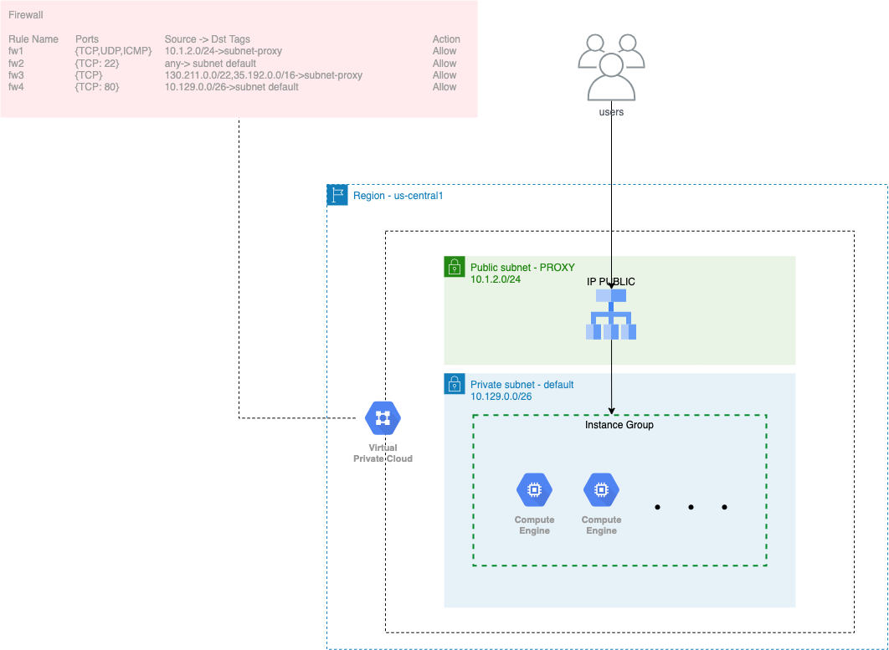

# Terraform Example LB in GCP

## Requirements
- Terraform 1.1.9
- Credential Json File in GCP

## Commands
###### Create Infraestructure
- `terraform init`
- `terraform validate`
- `terraform plan -auto-approve -var 'filecrential=$JSONFILE.json' -var 'project=$PROJECT'`
- `terraform apply -auto-approve -var 'filecrential=$JSONFILE.json' -var 'project=$PROJECT'`

##### Delete Infraestructure
- `terraform destroy -auto-approve -var 'filecrential=$JSONFILE.json' -var 'project=$PROJECT'`
